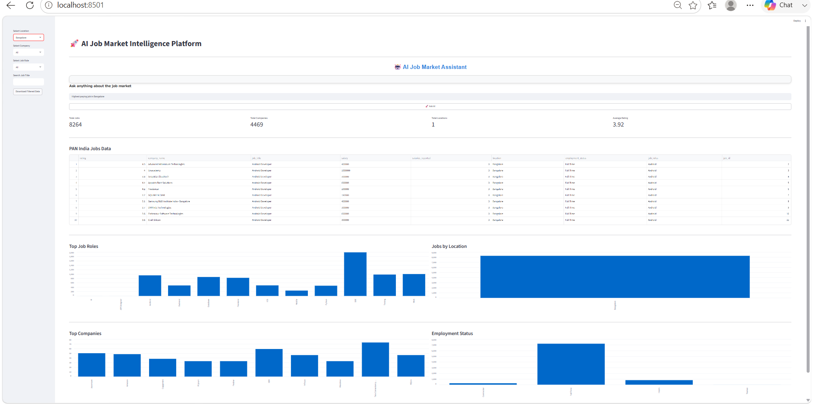
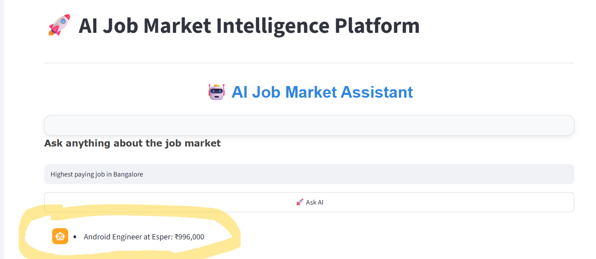
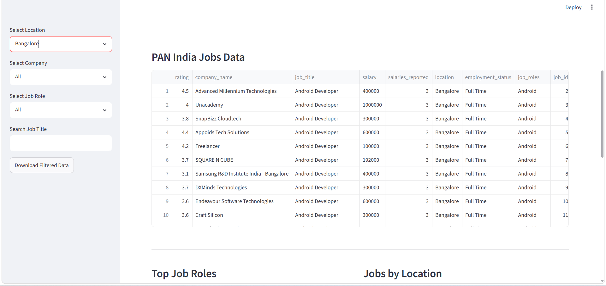
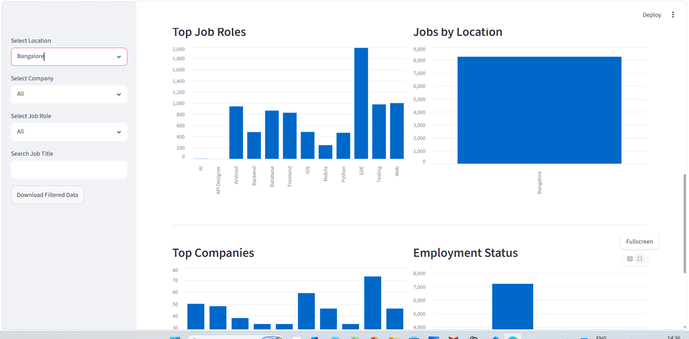
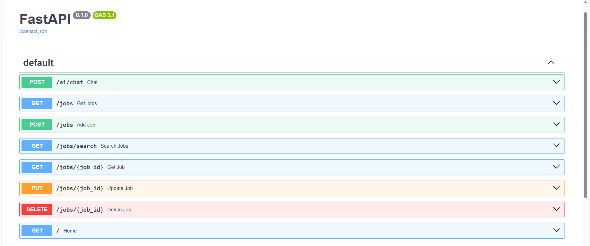
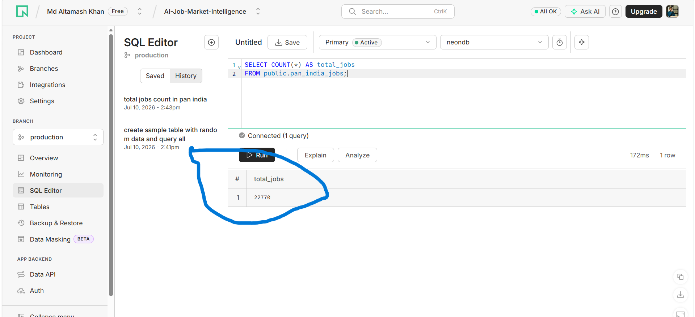

# 🚀 AI Job Market Intelligence Platform

An end-to-end Data Engineering and AI-powered Job Analytics project built using Python, PostgreSQL, FastAPI, Streamlit, and Google Gemini AI.

This project demonstrates the complete data pipeline—from raw CSV files to a cloud-hosted AI-powered dashboard.

---

# 📌 Project Overview

The goal of this project is to analyze job market data across India and allow users to:

- Search jobs
- Filter jobs
- Analyze companies
- View job statistics
- Ask questions in natural language using AI

The AI automatically converts user questions into SQL queries and returns human-friendly answers.

---

# 🛠️ Tech Stack

### Programming Language
- Python

### Data Analysis & Visualization
- Pandas
- Matplotlib

### Dataset
- Kaggle

### Database
- PostgreSQL
- Neon PostgreSQL (Cloud Database)

### Backend
- FastAPI
- REST API

### Frontend
- Streamlit

### Artificial Intelligence
- Google Gemini AI

### Version Control
- Git
- GitHub

---

# 📂 Project Journey

Instead of directly building the dashboard, this project was developed step by step.

## Step 1 — Python Practice

Started with Python basics to understand:

- Variables
- Functions
- Loops
- File Handling
- Pandas

Created small practice scripts before working on the real dataset.

---

## Step 2 — Small Dataset

Initially worked with a small dataset:

```
jobs.csv
```

Learned how to:

- Read CSV files
- Display data
- Check rows and columns
- Understand dataset structure

Example:

```python
pd.read_csv("jobs.csv")
```

---

## Step 3 — Large Dataset

After understanding the small dataset, switched to a real-world dataset:

```
Newdata.csv
```

This dataset contains thousands of job records collected across India.

---

## Step 4 — Data Analysis

Analyzed the dataset using Pandas.

Performed tasks like:

- Viewing columns
- Checking null values
- Understanding data types
- Finding duplicate records
- Exploring job roles
- Exploring company names
- Exploring locations

---

## Step 5 — Data Cleaning

Cleaned the dataset by:

- Removing unnecessary values
- Fixing missing data
- Standardizing columns
- Formatting text
- Preparing the dataset for database storage

Generated:

```
cleaned_newdata_utf8.csv
```

---

## Step 6 — PostgreSQL

Created a PostgreSQL database.

Created the table:

```
pan_india_jobs
```

Imported the cleaned_newdata_utf8.csv into PostgreSQL.

Learned:

- CREATE TABLE
- COPY
- SELECT
- WHERE
- GROUP BY
- ORDER BY
- LIMIT
- Aggregate Functions

---

## Step 7 — FastAPI Backend

# FastAPI Swagger


Built a RESTful backend using **FastAPI** to connect the dashboard with the PostgreSQL database.

Implemented complete CRUD (Create, Read, Update, Delete) operations along with AI-powered APIs.

### Available API Endpoints

#### Create Job

```http
POST /jobs
```

Adds a new job record to the database.

---

#### Read All Jobs

```http
GET /jobs
```

Fetches all job records from the database.

---

#### Search Jobs

```http
GET /jobs/search
```

Searches jobs based on filters such as company, location, or job title.

---

#### Update Job

```http
PUT /jobs/{job_id}
```

Updates an existing job record.

---

#### Delete Job

```http
DELETE /jobs/{job_id}
```

Deletes a job record from the database.

---

#### AI Job Assistant

```http
POST /ai/chat
```

Allows users to ask questions in natural language.

The AI converts the question into a PostgreSQL query, securely executes it on the database, and returns a human-readable response.

---

### Backend Features

- CRUD Operations
- REST APIs
- Database Integration
- AI-powered SQL Generation
- SQL Security Validation
- JSON Responses
- Error Handling
- Cloud Database Support (Neon PostgreSQL)
---

## Step 8 — Streamlit Dashboard


Built an interactive dashboard.

Features:

- Search Job Title
- Filter by Company
- Filter by Location
- Filter by Job Role
- Download Filtered Data
- Interactive Charts
- Metrics
- AI Chat Assistant

---

## Step 9 — AI Integration

# AI Assistant


Integrated Google Gemini AI.

Workflow:

User Question

↓

Gemini converts question into SQL

↓

FastAPI validates SQL

↓

SQL executes on PostgreSQL

↓

Gemini explains results in simple English

Example:

User:

> Highest paying jobs in Bangalore

Generated SQL:

```sql
SELECT ...
```

AI Response:

> The highest paying job available in Bangalore is...

---

## Step 10 — SQL Security

Implemented security rules:

✔ Only SELECT queries allowed

Blocked:

- INSERT
- UPDATE
- DELETE
- DROP
- ALTER
- TRUNCATE
- CREATE
- GRANT
- REVOKE

Protected against multiple SQL statements.

Allowed only:

```
public.pan_india_jobs
```

---

## Step 11 — Cloud Database

# Neon Cloud Database


Migrated the entire PostgreSQL database to:

Neon PostgreSQL

Successfully migrated:

- Schema
- Primary Key
- Job IDs
- 22,770 Job Records

Now the application uses a cloud-hosted PostgreSQL database.

---

# 📊 Dashboard Features

# Dashboard


✔ AI Job Assistant

✔ Search Jobs

✔ Company Filter

✔ Location Filter

✔ Job Role Filter

✔ Download CSV

✔ Charts

✔ Metrics

✔ Responsive Dashboard

---

# 📁 Folder Structure

```text
AI-Job-Market-Intelligence
│
├── api/
|__ routers/
├── dashboard/
├── data/
├── scripts/
├── sql/
├── notebooks/
├── README.md
├── requirements.txt
└── .gitignore
```

---

# 🚀 Project Workflow

```
Raw CSV

↓

Data Analysis

↓

Data Cleaning

↓

PostgreSQL

↓

Neon Cloud Database

↓

FastAPI APIs

↓

Gemini AI

↓

Streamlit Dashboard

↓

End User
```

---

# Future Improvements

- Authentication
- Docker
- Kubernetes
- CI/CD
- Job Recommendation Engine
- Resume Matching
- Salary Prediction
- AI Career Advisor

---

# Dashboard



---

# AI Job Market Assistant



---

# Filters

Users can filter jobs by:

- Location
- Company
- Job Role
- Job Title



---

# Data Visualization

Interactive charts provide insights into the job market.



---

# FastAPI Swagger



---

# Neon Cloud Database



---


# Author

Md Altamash Khan

Python | Data Engineering | FastAPI | PostgreSQL | Streamlit | AI